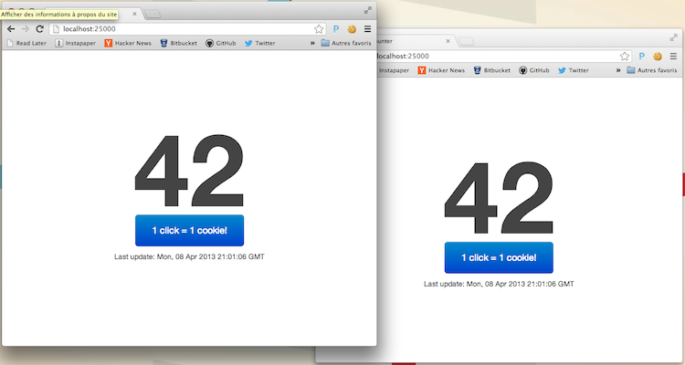

# Counter
This little application is using [Node.js](http://nodejs.org/) and [Socket.IO](http://socket.io/) to display a synchronized counter between multiple browsers.



A Database linkage is optional but can be performed with [node-mysql](https://github.com/felixge/node-mysql) in config.js.

## Why?
It was a test for [Solib](https://github.com/ECE-Campus-Cluster/SoLib) and my first Node.js experience. Why a counter? Because it's supposed to be scalable. So once your installation is running, **don't hesitate to violently sacrifice your mouse/trackpad for science.**

## How to use it
1. Node.js can be downloaded [here](http://nodejs.org/download/).
To install all plugin dependencies, run the following command in the Counter directory:
```bash
npm install
```
You should now have a directory named `node_modules` with a `socket.io` and `mysql` folders in it.

2. Configure your app in config.js **and** write `http://yourdomain:yourport` in the index.html `io.connection` function.

3. Run the server with the following command:
```bash
node server.js
```

4. Open your browser and go to `http://yourdomain:yourport` (address of your Node.js server). That's it.

5. Now click like Hell.

## Tips
You can also make the server run as a background process using:
```bash
nohup node server.js > output.log &
```

* By taping the `/supersecretfunction` request, you will reset the counter to 0.

## Licensing
Copyright (C) 2013 by Thibault Charbonnier.

Permission is hereby granted, free of charge, to any person obtaining a copy of this software and associated documentation files (the "Software"), to deal in the Software without restriction, including without limitation the rights to use, copy, modify, merge, publish, distribute, sublicense, and/or sell copies of the Software, and to permit persons to whom the Software is furnished to do so, subject to the following conditions:

The above copyright notice and this permission notice shall be included in all copies or substantial portions of the Software.

THE SOFTWARE IS PROVIDED "AS IS", WITHOUT WARRANTY OF ANY KIND, EXPRESS OR IMPLIED, INCLUDING BUT NOT LIMITED TO THE WARRANTIES OF MERCHANTABILITY, FITNESS FOR A PARTICULAR PURPOSE AND NONINFRINGEMENT. IN NO EVENT SHALL THE AUTHORS OR COPYRIGHT HOLDERS BE LIABLE FOR ANY CLAIM, DAMAGES OR OTHER LIABILITY, WHETHER IN AN ACTION OF CONTRACT, TORT OR OTHERWISE, ARISING FROM, OUT OF OR IN CONNECTION WITH THE SOFTWARE OR THE USE OR OTHER DEALINGS IN THE SOFTWARE.
